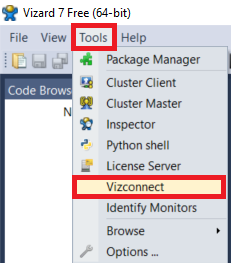

# Cortivision fNIRS-VR tutorial

This repository contains example application which shows how to use fNIRS with VR. 

# Table of contents

- [Introduction](#introduction)
- [Installing the environment](#installing-the-environment)
- [VR set configuration](#vr-set-configuration)
- [Getting your feet wet](#getting-your-feet-wet)
- [Experiment description](#experiment-description)
- [Block structure and configuration](#block-structure-and-configuration)
- [Logging the resutls](#logging-the-resutls)
- [HTTP communication](#http-communication)
- [Experiment info input](#experiment-info-input)
- [General notes](#general-notes)
- [General experiment outline: Top to bottom development](#general-experiment-outline-top-to-bottom-development)
- [Separate modules implementation](#separate-modules-implementation)
- [Implementation of the experiment parameter initialization](#implementation-of-the-experiment-parameter-initialization)
- [Showing initial instruction](#showing-initial-instruction)
- [Training stage](#training-stage)
- [Generating random trial](#generating-random-trial)
- [Running a trial](#running-a-trial)
- [Showing feedback](#showing-feedback)
- [Running the experiment](#running-the-experiment)
- [References](#references)

## Introduction
Vizard software allows easy debugging and fast VR development. It has a lot of basic tools, such as VR environments, 3D objects and quite a sophisticated physics engine. In this tutorial, I will show you how to create your experiment. As an example, I will describe my experiment step by step. The complete experiment script, as well as intermediate versions of the script, are available in the repository under the following URL: https://github.com/mtokovarov/nirs_vr_worldviz.

## Installing the environment
First, you need to install the environment. It can be downloaded under the following link: https://264tz51r.paperform.co/. Basic personal and contact data have to be provided. The download link will be sent to the specified email address upon submitting the required data. The installation process is pretty straight forward: in order to install the software, the downloaded file has to be run, a routine installation process has to be performed. After installing the environment you can configure your VR set and create a basic scene.

## VR set configuration
In order to be able to debug the code with a VR set, the set has to be initialized.
To use VR equipment in the experiments, you have to install Steam and add the SteamVR application to the Steam. The app will be responsible for maintaining the connection between the computer running the experiment and the VR kit.
The following solutions are supported in Vizard:
- Oculus Rift S , Quest (tethered) and CV1
- VizMove  with various options
- Windows Mixed Reality
- HTC Vive with StreamVR
- ViveTracker Full Body Tracking

To run the VR version of the experiment, you have to create a configured file for the VR kit you have. The vizconnect tool is used for this purpose. Make sure that your VR goggles and controllers are connected to the computer and active. In order to create a config file, you will have to take the following steps:
1.	select tools→vizconnect, as Figure 1 shows, a dialog window will appear with the message “You are creating a new configuration file. It is strongly suggested that you save your work before continuing”. Save your work if you have already created some file.
Figure 1. Starting the config file creation procedure.


2.	The “Vizconect Startup” window, shown on Figure 2, will appear. The default configuration can be run by selecting the first option (“Select from some common preset configuration”). In most cases, it is sufficient.


3.	The list of supported produce	rs will appear in the form of the window shown on the Figure 3. Select you producer. Press the “Apply preset” button. Press the “Save” button and specify the location and the name of the configuration file.


4.	In order to use the configuration file add the following line to your code: vizconnect.go('filename_specified_in_previous_section.py').

## Getting your feet wet
Now, as your VR set is connected, you can create a simple script allowing you to test your goggles in a VR environment.
In the File drop down menu select the New Vizard File option in order to create a new script. You can also download an example script “script1_hello_vizard.py” available in my repo. The listing below presents the content of the file.


Listing 1. Content of the file `script1_hello_vizard.py`.
```python
#Imports of the libraries used in the file
import viz
import vizcam
import vizconnect

#adding VR environment
model = viz.addChild('dojo.osgb')
#the number of fullscreen anit-aliasing samples to perform after each frame rendered.
#The more samples, the smoother geometry edges will be.
#However, more samples increase rendering time. The common sample levels are 2, 4, and 8.
viz.setMultiSample(8)
#the vertical field of view for the main window in degrees.
viz.fov(60)
#VR set config file
vizconnect.go('example_HTC_preset.py')
```
Fig 4 below shows the view of the VR scene created by the Listing 1. The controllers are shown with the robotic – looking hands. In case if you want to delete them or change their view, you will have to modify the VR config file (`example_HTC_preset.py`) as Listing 2 shows.


Listing 2. Setting hands visibility.
```python
rightHand = False #change to True, if you want to show the hands
leftHand = False #change to True, if you want to show the hands
avatar.visible(rightHand, r'mark_hand_r.cmf')
avatar.visible(leftHand, r'mark_hand_l.cmf')
```
Now as we set up the environment we can proceed to the experiment itself.

## Experiment description
First, the experiment is described in general. Here we show its idea and main aspects.
The implemented experiment includes the version of the Eriksen flanker task[1] adopted to VR environment.
The concept of the flanker task is the following: the participant has to press the trigger of a correspondent controller as a response to the shown stimuli. The stimuli have the form of sequences of 7 arrows. The choice of the controller is based upon the direction in which the central arrow is pointed. The stimuli can be of the following forms:
- `< < < < < < <` - congruent left - the participant has to press the left controller trigger,
- `> > > > > > >` - congruent right - the participant has to press the right controller trigger,
- `> > > < > > >` - incongruent left - the participant has to press the left controller trigger,
- `< < < > < < <` - incongruent right - the participant has to press the right controller trigger.


In one trial one stimulus is shown. The trials are gathered into blocks. In order to utilize the possibilities of VR kit in full extend we also incorporated in our experiment a version of Simon Task [2]. The vibration of the controllers is used as a cue, that can be relevant of irrelevant. However, the participant is not informed about the fact, that the vibration can be relevant or irrelevant. He/she sees it only as a trigger for response. There are three types of blocks, differing from each other by the type of vibration generated in the VR kit controllers:
•	neutral_distractor – the virbation is generated in both controllers, neutral cue in the sense of Simon task,
•	congruent_distractor – the vibration is generated in the controller, corresponding to the direction in which the central arrow is pointed, relevant cue in the sense of Simon task,
•	incongruent_distractor – the vibration is he vibration is generated in the controller, opposite to the direction in which the central arrow is pointed, irrelevant cue in the sense of Simon task.
After every block a rest phase is run. During the rest phase the participant has to relax and avoid both intensive physical and cognitive activity.

## Block structure and configuration
Each block includes 16 trials. The configurations of individual blocks are stored in .csv files in the folder block_config_single_taks_flanker, the path to the folder is stored as the constant entitled BLOCK_STRUCTURE_FOLDER_PATH. The configuration data are read from the files by the function “get_trail_block_data” discussed in the further part of the tutorial.


The blocks are grouped into the block groups. Each block group consists of 6 blocks. The blocks in a group are shuffled before the start of the experiment. After the finish of every block, the rest state procedure is carried out. During the rest state, the participant has to relax and avoid intensive cognitive activity.

## Logging the resutls
The data gathered in the experiment are logged in a .csv file, which name has to be provided during initial stage of the experiment when experiment data are read. The data are logged after every trial, so even if the app crashes due to some reason, the data are safely written.


## HTTP communication
Special markers are sent via HTTP in the following cases:
- start of experiment
- stop of experiment
- start of block
- start of rest phase.
The IP address has to be provided during the initial  stage of the experiment when experimental data are read. The IP has to be provided in the form address:port. In case of IP address is not provided, HTTP communication is not used.

## Experiment info input
In order to provide basic experiment information as special form is implemented. The are provided in the fields of this form and are used later in the process of the experiment.


## General notes
The code was written in a self-documenting manner, we tried to make the names of variables and functions as explicit and readable as possible. Sometimes, by the cost of using too much space. However, we consider explicitness of the highest importance.
The process of developing the experiment was presented in the form of logical steps: from very beginning to the complete code. All the steps can be found in the folder example_scripts. All the scripts are fully runnable, so you can download them and step by step understand the logic behind the created experiment. Every next file contains the same code as the previous scripts, plus new elements.
The following files are available:
1.	script1_hello_vizard.py – getting you feet wet,
2.	script2_general_outline.py – general experiment outline,
3.	script3_gather_experiment_info.py – input of experiment info and parameters,
4.	script4_show_initial_instruction.py – showing initial instruction to the participant,
5.	script5_run_training.py – the procedure of training, where the participant runs through several example trials and receives the feedback for them,
6.	script6_run_blocks.py – complete experiment with running all blocks and trials, logging the results and HTTP communication.

## General experiment outline: Top to bottom development
The experiment is implemented in a procedural manner. We choose this approach because that the cognitive science researchers, being the main target group of the project, may not be familiar with the advanced concepts of, e.g., object oriented programming. So we tried to make the program as simple and straightforward as possible.
Python allows us to implement the experiment in a top-to-bottom manner. It means that we start with defining the most upper-level outline of the experiment. The separate modules of the experiment can be implemented independently. The functions, that are not yet implemented can contain a “plug” with, e.g. print command, which would allow to run them nevertheless.
Listing 3 presents the general outline of the experiment. The main function to be called is run_experiment. So, in our experimen,t we want to:
1.	initialize all the necessary variables,
2.	show the participant the initial instruction,
3.	run the training stage
4.	run blocks of the trials
Note that to run the main experiment functionwe have to schedule it with viztask.schedule command. The command requires a special library: viztask, so its import is added as well. The definitions of the separate step functions can be found below the run_experiment function. For now they contain only plugs in the form of print(…) commands. You can check out how the code works by copying the Listing 3 or opening the file `script2_general_outline.py`.
Listing 3. General outline of the experiment.
```python
import viz
import vizcam
import vizconnect
import viztask
#the main experiment function
def run_experiment():
    init_experiment()
    show_initial_instruction()
    run_training()
    run_blocks()
def init_experiment():
	print('init_experiment function')
def show_initial_instruction():
	print('show_initial_instruction function')
def run_training():
	print('run_training function')
def run_blocks():
	print('run_blocks function')
model = viz.addChild('dojo.osgb')
viz.setMultiSample(8)
viz.fov(60)
vizconnect.go('example_HTC_preset.py')
#scheduling the main function
viztask.schedule(run_experiment)
```

## Separate modules implementation
This section presents the implementation of the functions declared in Listing 3 one by one. Constant values used in the code are marked with CAPITAL LETTERS.

## Implementation of the experiment parameter initialization
In the initialization stage, we want to perform the following steps:
1.	initialize the starting time of the experiment,
2.	gather participant’s information
3.	intialize the viewpoint as well as the procedure for it resetting
4.	initialize the controllers.
Listing 4 show the outline of this function.
Listing 4. Outline of the init_experiment function.
```python
def init_experiment():
    init_experiment_start_time()
    init_view_point_reset()
    init_controllers()
    yield gather_experiment_info()
```
Listing 5 shows how the experiment start time is initialized. As you can see, we use it as global variable. As we all know, using a global variables is not a particularly good solution for good projects. However, this solution solves many problems with the acceptable cost for smaller scripts, just like this one. The library datetime used for getting the initial date has to be imported.
Listing 5. The function for initialization of start time of the experiment.
```python
def init_experiment_start_time():
    global experiment_start #global variable
    experiment_start = datetime.datetime.utcnow() #the module datetime has to be imported
```
Listing 6 shows the view point initialization. Position and azimuth are set with the parameters pos and euler. The action  resetViewpoints is bound to the k key, this solution would be helpful  when the participant is not centered or moved in the course of the experiment.
Listing 6. Initialization of view point.
```python
def init_view_point_reset():
    oriMode = vizconnect.VIEWPOINT_MATCH_DISPLAY
    posMode = vizconnect.VIEWPOINT_MATCH_FEET
   
    # Add a vizconnect viewpoint.
    vp = vizconnect.addViewpoint(   pos=[0,0,0], #position
                                    euler=[0, 0, 0],                  #azimuth
                                    posMode=posMode,
                                    oriMode=oriMode,
    )
    vp.add(vizconnect.getDisplay())
    vizconnect.resetViewpoints()
    # add a reset key so when r is pressed the user is moved back to the viewpoint
    vizact.onkeydown('r', vizconnect.resetViewpoints)
```
Listing 7 shows the procedure of VR kit controller initialization. A special library, steamvr is used to obtain the handlers ensuring access to the controllers. In case if not all the controllers are connected, the exception is thrown, as we need both controllers for the experiment. Besides of finding the controllers also it is defined, which one is left and which one is right. The string used for it 'l_hand_input' can be different for other VR kit producers (we used HTC Vive).
Listing 7. Initialization of the VR kit controllers.
```python
def init_controllers():
    global LEFT_CONTROLLER,  RIGHT_CONTROLLER
    controllers = steamvr.getControllerList()
    if len(controllers) < 2:
        raise('Not all controllers connected')
    if controllers[0]._vizconnectName == 'l_hand_input':
        LEFT_CONTROLLER = controllers[0]
        RIGHT_CONTROLLER = controllers[1]
    else:
        LEFT_CONTROLLER = controllers[1]
        RIGHT_CONTROLLER = controllers[0]
```
The last function discussed in this block is used for gathering the participant’s data. Its definition is presented on the Listing 8 below. In order to make the definition clearer, we created a separate function get_participant_data. As you can see a special class Experiment is used there. This class is defined in a stand alone library vexptoolbox which is aliased as vx in the code. This library was presented in the article [3]. It allows for making some aspects of the experiment more convinient.

Special note should be taken on how requestParticipantData method is called. As you can see, it is called with the yield keyword. It is the usual way of calling methods that are supposed to wait for some participant's reaction. E.g. in this case we want to wait, until the participant provides the info and clicks the button save, as Fig 9 shows.
The yield calling is a standard tool in the Vizard environment, and we will often meet the yield constructions.
Another important aspect is that the function containing a yield construction has also be called with the yield keyword. And the function, which calls it, is called with yield as well, and so on. E.g. check the Listing 4, where we have gather_experiment_info() called with yield. Correspondingly, the function  init_experiment() has to be called with yield on the Listing 3.
Listing 8. Gathering the participant’s information.
```python
def gather_experiment_info():
    global PATIENT_NAME,  RECORD_FILE_NAME, IP, IS_WITH_HTTP
    questions = ['IP']
    PATIENT_NAME, gender, age,
                        EXPERIMENT_NAME, IP = yield from get_participant_data(questions)
    RECORD_FILE_NAME = f'PATIENT_{PATIENT_NAME}_
                                                {gender}_{age}_sess_{EXPERIMENT_NAME}_
                                                {datetime.datetime.utcnow().strftime("%Y-%m-%d %H.%M.%S")}'
    IS_WITH_HTTP = not IP == ""

def get_participant_data(questions = []):
    ex = vx.Experiment(name='Example',
                   debug=False,
                   auto_save=False)
    yield ex.requestParticipantData(questions = questions)
    return ex.participant.id, ex.participant.gender,
               ex.participant.age, ex.participant.session,
               ex.participant.IP
```
The complete version of the script, containing definition of the function gather_experiment_info() can be found as the `script3_gather_experiment_info.py` script.


## Showing initial instruction
The next step, including a demonstration of initial instruction, is discussed in this section. This step is the shortest in the whole procedure. Listing 9 presents the definition of the function. As you can see, the function waitVRInstruction defined in the library vexptoolbox is also called with the yield keyword. This is because  the message is shown until the user presses a button on the controller, to which the handler is passed as the second argument. In our case, it is the right controller. The script with the experiment implemented to this stage is available in the form of `script4_show_initial_instruction.py` file.   

Listing 9. Definition of show_initial_instruction function.
```python
def show_initial_instruction():
    instructions = """
                    You are taking a part in an experiment, read the instructions carefully.
                    1. The stimuli will be shown in the form of the following symbols:
                    
                         < < < < < < <, > > > < > > >, > > > > > > >, < < < > < < <.
                    
                    2. When you feel the wibration of the controllers, you have to answer
                    specifying the direction of the central symbol of the shown stimulus
                    by pressing the trigger of correspondent joystick.
                    
                    For the above example the results fould be:
                    < (left), < (left), > (right), > (right)

                    3. That's it! Press right joystick trigger to start the training session."""

    yield vx.waitVRInstruction(instructions, controller=RIGHT_CONTROLLER,
                                                 title = 'Instruction')
```

## Training stage
The overall outline of the training stage is presented on the Listing 10. As you can see, the idea is very simple: we perform TRAINING_TRIAL_CNT training trials. Every trial is generated in a random way (get_random_trial). Later it is run, as you can notice, the function is called with yield keyword. What’s interesting is the fact, that want to obtain some result from the function. In this case we combine the yield and from keywords. The function show_feedback is responsible for showing feedback to the participant, hence it receives two arguments: trial and results of the trial run. The function is going to wait for the participant’s response, hence it is called with yield as well.
Listing 10. General outline of the training stage.
```python
def run_training():
    for _ in range(TRAINING_TRIAL_CNT):
        trial = get_random_trial()
        results = yield from run_trial(trial)
        yield show_feedback(trial, results)
```
Below we will present the implementation of the functions outlined on the Listing 10.

## Generating random trial
The process of generating a random trial is presented on Listing 10. The library numpy (referenced with the alias np) is used for random selection of the trial parameters. The parameters later are packed into dictionary.
Listing 11. Generating random trial.
```python
def get_random_trial():
    flanker_type = np.random.choice(['left', 'right'],size = 1)[0]
    distraction_congruencity = np.random.choice(['neutral', 'congruent', 'incongruent'],
                                                                              size = 1)[0]
    flanker_congruencity = np.random.choice(['congruent', 'incongruent'],
                                                                         size = 1)[0]
    
    return {'flanker_type': flanker_type,
                'distraction_congruencity': distraction_congruencity,
                'flanker_congruencity': flanker_congruencity}
```

## Running a trial
It is probably the most complicated function. It is presented on Listing 12. First, three local variables are declared. They will have to store the provided response, the time needed for providing the response and finally: the correctness of the response.
The stimulus is shown with the function flanker_show_stimulus(), which definition can be found on the Listing 13. A special local function on_response_provided is defined here. It is necessary for capturing the user's response.
The function on_response_provided() is bound to the event with ID SENSOR_DOWN_EVENT. When such event occurs (when the participant presses a controller trigger), the function  on_response_provided is called and all the response parameters are written and the stimulus is hidden by the command stimulus.visible(viz.OFF).
The time of beginning the trial is written in the function get_time_from_experiment_start() (find its definition in the script “script5_run_training.py”).
The distraction in the form of vibration is run afterwards, the function run_distraction() is responsible for it. Its definition can be found on Listing 14.
When the participant provides the answer or the time specified by TOTAL_TRIAL_TIME passes, the stimulus is hidden and the function on_response_provided is unbound from the event. The last action performed in the function run_trial is packing the response into dictionary and returning this dictionary.
Listing 12. Running a trial.
```python
def run_trial(trial):
    response_provided = None
    response_time = None
    is_correct = None
    stimulus = flanker_show_stimulus(trial['flanker_type'], trial['flanker_congruencity'])
    def on_response_provided(event):
        nonlocal response_time, response_provided, stimulus, is_correct
        response_time = (get_time_from_experiment_start() - start_time).total_seconds()
        if event.object == LEFT_CONTROLLER:
            response_provided = 'left'
        if event.object == RIGHT_CONTROLLER:
            response_provided = 'right'
        is_correct = trial['flanker_type']==response_provided
        stimulus.visible(viz.OFF)
            
    viz.callback(viz.SENSOR_DOWN_EVENT,on_response_provided)
    start_time = get_time_from_experiment_start()
    run_distraction(trial['flanker_type'], trial['distraction_congruencity'])
    yield viztask.waitTime(TOTAL_TRIAL_TIME)
    stimulus.remove()
    viz.callback(viz.SENSOR_DOWN_EVENT,None)
    
    return make_dict_of_args(response_provided=response_provided,
                            trial_start_time = start_time.total_seconds(), response_time = response_time,
                            is_correct = is_correct)

def make_dict_of_args(**kwargs):
     body = kwargs
     return body
```

The function flanker_show_stimulus() presents the way of creating a stimulus in the form of 3D text. The text is generated by the function get_stimulus_str(), which essentially contains only mapping of the input arguments by the means of the dictionary. The function  show_message_on_fixed_position_with_random_shift is used for showing specified messages, its definition can be found in the script `script5_run_training.py`, we do not place it here, as we do not need such low level details.
Listing 13. The definition of the function responsible for showing a stimulus of specified parameters.
```python
def flanker_show_stimulus(flanker_type, flanker_congruencity):
    message = get_stimulus_str(flanker_type, congruent)
    return show_message_on_fixed_position_with_random_shift(message,
                                                                      size_scaler = FLANKER_SIZE_SCALER,
                                                                      shift_val = 0.5, color = (0.53,0.81,0.92))
def get_stimulus_parts(flanker_type, congruent):
    flanker_dict = {
                    ('left', 'congruent'): '< < < < < < <',
                    ('left', 'incongruent'): '> > > < > > >',
                    ('right', 'congruent'): '> > > > > > >',
                    ('right', 'incongruent'): '< < < > < < <',
                    ('left', 'neutral'):'= = = < = = =',
                    ('right', 'neutral'):'= = = > = = ='
    }
    return flanker_dict[(flanker_type, congruent)]
```

The function run_distraction() contains two steps:
1.	selecting necessary controllers,
2.	generating pulse vibration with selected controllers.
Selecting the controller is carried out similarly to selecting the flanker stimulus string: we use a dictionary for readability.
The function pulse_vibration() generates the vibration according to the provided arguments. To avoid the influence upon the general experiment timeline, the vibration is triggered in a separate thread. Due to this we need another library: threading.
Listing 14. Definition of the function responsible for generating vibration.

```python
def run_distraction(flanker_type, distraction_congruencity):
    controllers = get_controllers_for_distraction(flanker_type, distraction_congruencity)
    pulse_vibration(controllers)

def get_controllers_for_distraction(flanker_type, distraction_congruencity):
    controller_distract_dict = {
                    ('left', 'congruent'): [LEFT_CONTROLLER],
                    ('left', 'incongruent'): [RIGHT_CONTROLLER],
                    ('right', 'congruent'): [RIGHT_CONTROLLER],
                    ('right', 'incongruent'): [LEFT_CONTROLLER],
                    ('left', 'neutral'): [LEFT_CONTROLLER, RIGHT_CONTROLLER],
                    ('right', 'neutral'):[LEFT_CONTROLLER, RIGHT_CONTROLLER]
    }
    return controller_distract_dict[(flanker_type, distraction_congruencity)]
def pulse_vibration(controllers):    
    def func():
        for i in range(PULSE_CNT):
            for controller in controllers:
                controller.setVibration(PULSE_TIME, amplitude=1)
            viz.waitTime(PULSE_TIME)
            viz.waitTime(INTER_PULSE_TIME)
    Thread(target = func).start()
```

## Showing feedback
The last step in every iteration of the training stage includes showing the feedback. The definition of the correspondent function is showed on the Listing 15. The feedback is constructed according to the arguments that are passed to the function. The feedback is shown in the form of a 3D text message by the function show_message_waiting_for_button(). The definition of the function can be found in the script “script5_run_training.py”. Since the function contains waiting for event (pressing a button), it has to be called with yield keyword.
The code written for training stage can be found in the form of `script5_run_training.py` file.
Listing 15. Definition of show_feedback function.
```python
def show_feedback(trial, results):
    message = ''
    if results['response_provided'] is None:
        message += 'Too long!\n'
    elif results['response_provided'] == trial['flanker_type']:
        message += 'Correct  answer!\n'
    else:
        message += 'Wrong  answer!\n'
    message += 'Press any key to continue!'
    yield show_message_waiting_for_button(message)
```

## Running the experiment
When the participant gets familiar with the procedure, the main part of the experiment is started. As usually, we start from the very general outline. In the main experiment procedure, the following actions are carried out:
1.	The message with initial announcement is shown. The participant can prepare for the experiment and approve his/her readiness by pressing a button.
2.	If we use HTTP communication, the message indicating the start of the experiment is sent.
3.	A rest phase is run.
4.	The block configuration data are read with the function get_trial_block_data().
5.	Iteratively all the blocks are carried out. The complete blocks in the groups as well as the trials in individual blocks are shuffled before start of correspondent iteration.
6.	The marker is sent before every block.
7.	run_trial() function that we have already seen in the previous section is used.
8.	Logging in thread is performed.
Listing 16. General outline of the main experiment.

```python
def run_blocks():
    yield show_message_waiting_for_button("Press any button, when you are ready for the experiment")
    if IS_WITH_HTTP:
        send_start_record()
        
    yield run_rest_phase(REST_TIME)
    trial_blocks = get_trial_block_data()
    for i in range(GROUP_NUMBER):
        random.shuffle(trial_blocks)
        for block in trial_blocks:
            if IS_WITH_HTTP:
                send_marker(block['name'])
            random.shuffle(block['data'])
            for trial in block['data']:
                result = yield from run_trial(trial)
                log_feedback_in_thread(({'block': block['name'], **trial, **result},))            
            yield run_rest_phase(REST_TIME)
```

The blocks are prepared by the function which definition is presented on the Listing 17.
The function presented on this Listing require the libraries os and pandas.
The data read for blocks are supposed to be in the .csv files stored under the path specified by the variable BLOCK_STRUCTURE_FOLDER_PATH. The data are read with the pandas library. The number of blocks in group, as well as the number of groups, are specified in the global variables.
Listing 17. Preparing the block data.

```python
def get_trial_block_data():
    block_set, block_names = read_block_data()
    group_of_trial_blocks = block_set*BLOCK_SET_IN_GROUP_NUMBER
    group_of_trial_block_names = block_names*BLOCK_SET_IN_GROUP_NUMBER
    trial_blocks = [{'name':n, 'data': b}
                                              for n, b in zip(group_of_trial_block_names, group_of_trial_blocks)]
    return trial_blocks
def read_block_data():
    block_files = os.listdir(BLOCK_STRUCTURE_FOLDER_PATH)
    blocks = []
    block_names = []
    for block_file in block_files:
        data = pd.read_csv(f'{BLOCK_STRUCTURE_FOLDER_PATH}//{block_file}', sep = ',')
        columns = data.columns.to_list()
        data = [{col:val for col, val in zip(columns, row)} for row in data.values]
        blocks.append(data)
        block_names.append(block_file.split('.')[0])
    return blocks, block_names
```


The rest phase run after every block is carried out in accordance with the procedure presented on the Listing 18.
Listing 18. Definition of rest phase.
```python
def run_rest_phase(rest_time):
    if IS_WITH_HTTP:
        send_marker('relax')
    last_seconds = 5
    text = show_message_on_fixed_position('Relax...')
    yield viztask.waitTime(rest_time-last_seconds-2)
    text.remove()
    for i in range(last_seconds):
        message = f'The rest phase will be over in {last_seconds - i} seconds'
        text = show_message_on_fixed_position(message)
        yield viztask.waitTime(1)
        text.remove()
    text = show_message_on_fixed_position('Action!')
    yield viztask.waitTime(1)
    text.remove()
    yield viztask.waitTime(1)
```

The logging procedure is described on the Listing 19. Logging is carried out with the use of pandas library. Logging is performed after every trial: the trial results are appended to the existing file. In order to avoid time-related issues the logging process is carried out in a separate thread. The data are saved in the folder which title is specified by the variable TARGET_FILE_PATH and the name of the file is stored in the variable RECORD_FILE_NAME.
Listing 19. Definitions of the logging procedure.
```python
def log_feedback(feedback):
    global logging_started
    pd_data = pd.DataFrame(feedback, index=[0])
    path = f'{TARGET_FILE_PATH}\\{RECORD_FILE_NAME}.csv'
    if not os.path.exists(path) or not logging_started:
        pd_data.to_csv(path, mode='w', index=False, header=True, sep = ';')
        logging_started = True
    else:
        pd_data.to_csv(path, mode='a', index=False, header=False, sep = ';')

def log_feedback_in_thread(kwargs):
    run_in_thread(log_feedback, kwargs)
def run_in_thread(func, args = ()):
    func_lambda = lambda : func(*args)
    thread = Thread(target = func_lambda)
    thread.start()
```

Listing 20 contains the functions related to sending HTTP requests. The library requests used for sending HTTP requests has to be imported.
The variable  STR_TO_HTTP_CODE_DICT stores dictionary allowing to map between the strings with block names and the integer IDs.
Listing 20. HTTP related functions
```python
def send_start_record():
    requests.post(f'{IP}/startRecord?filename={EXPERIMENT_NAME}_{PATIENT_NAME}')
def send_marker(marker):
    requests.post(f'{IP}/toggleMarker?id={STR_TO_HTTP_CODE_DICT[marker]}')
def send_stop_record():
    requests.post(f'{IP}/stopRecord')
```

## References

[1] Eriksen, B. A., & Eriksen, C. W. (1974). Effects of noise letters upon the identification of a target letter in a nonsearch task. Perception & psychophysics, 16(1), 143-149.

[2] Craft, J. L., & Simon, J. R. (1970). Processing symbolic information from a visual display: interference from an irrelevant directional cue. Journal of experimental psychology, 83(3p1), 415.

[3] Schuetz, I., Karimpur, H., & Fiehler, K. (2022). vexptoolbox: A software toolbox for human behavior studies using the Vizard virtual reality platform. Behavior Research Methods, 1-13.
